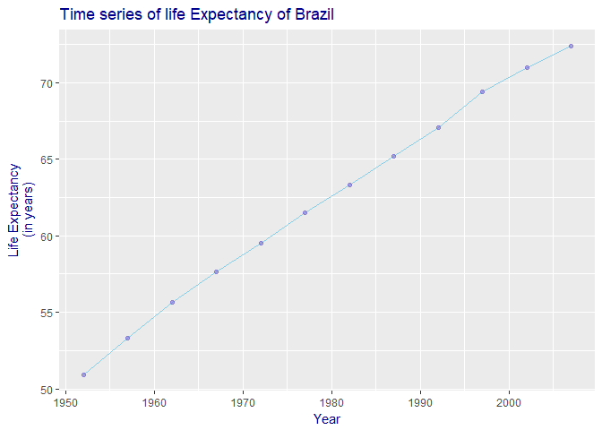

Homework 04: Tidy data and joins
================
Cecilia Leon

The Assignment
--------------

This is a "choose your own adventure"-style assignment, where you are expected to do the following two things:

1.  Pick one of the data reshaping prompts and do it.
2.  Pick one of the join prompts and do it.

It is fine to work with a new dataset and/or create variations on these problem themes.

### Data Reshaping Prompts (and relationship to aggregation)

**Problem**: You have data in one "shape" but you wish it were in another. Usually this is because the alternative shape is superior for presenting a table, making a figure, or doing aggregation and statistical analysis.

**Solution**: Reshape your data. For simple reshaping, `gather()` and `spread()` from `tidyr` will suffice. Do the thing that is possible / easier now that your data has a new shape.

**Prompts**:

#### Activity \#2

-   Make a tibble with one row per year and columns for life expectancy for two or more countries.
    -   Use `knitr::kable()` to make this table look pretty in your rendered homework.
    -   Take advantage of this new data shape to scatterplot life expectancy for one country against that of another.

> In this case, gapminder is presented in **untidy** format and we need to convert it to a **tidy** object by the command `spread` with the following parameters:

| Paramater | Value   |
|-----------|---------|
| key       | country |
| value     | lifeExp |

This is an example of two countries wich are Mexico and Canada

``` r
gapminder %>% 
  filter(country == "Mexico" | country == "Canada") %>% 
  select(c("year","country","lifeExp")) %>% 
  spread(key="country", value = "lifeExp") %>% 
  kable()
```

<table>
<thead>
<tr>
<th style="text-align:right;">
year
</th>
<th style="text-align:right;">
Canada
</th>
<th style="text-align:right;">
Mexico
</th>
</tr>
</thead>
<tbody>
<tr>
<td style="text-align:right;">
1952
</td>
<td style="text-align:right;">
68.750
</td>
<td style="text-align:right;">
50.789
</td>
</tr>
<tr>
<td style="text-align:right;">
1957
</td>
<td style="text-align:right;">
69.960
</td>
<td style="text-align:right;">
55.190
</td>
</tr>
<tr>
<td style="text-align:right;">
1962
</td>
<td style="text-align:right;">
71.300
</td>
<td style="text-align:right;">
58.299
</td>
</tr>
<tr>
<td style="text-align:right;">
1967
</td>
<td style="text-align:right;">
72.130
</td>
<td style="text-align:right;">
60.110
</td>
</tr>
<tr>
<td style="text-align:right;">
1972
</td>
<td style="text-align:right;">
72.880
</td>
<td style="text-align:right;">
62.361
</td>
</tr>
<tr>
<td style="text-align:right;">
1977
</td>
<td style="text-align:right;">
74.210
</td>
<td style="text-align:right;">
65.032
</td>
</tr>
<tr>
<td style="text-align:right;">
1982
</td>
<td style="text-align:right;">
75.760
</td>
<td style="text-align:right;">
67.405
</td>
</tr>
<tr>
<td style="text-align:right;">
1987
</td>
<td style="text-align:right;">
76.860
</td>
<td style="text-align:right;">
69.498
</td>
</tr>
<tr>
<td style="text-align:right;">
1992
</td>
<td style="text-align:right;">
77.950
</td>
<td style="text-align:right;">
71.455
</td>
</tr>
<tr>
<td style="text-align:right;">
1997
</td>
<td style="text-align:right;">
78.610
</td>
<td style="text-align:right;">
73.670
</td>
</tr>
<tr>
<td style="text-align:right;">
2002
</td>
<td style="text-align:right;">
79.770
</td>
<td style="text-align:right;">
74.902
</td>
</tr>
<tr>
<td style="text-align:right;">
2007
</td>
<td style="text-align:right;">
80.653
</td>
<td style="text-align:right;">
76.195
</td>
</tr>
</tbody>
</table>
> But we can do this by *n* different countries, in the following example the `filter` criteria will change to the countries of Americas:

``` r
Americas_reshape <- gapminder %>% 
                      filter(continent == "Americas") %>% 
                      select(c("year","country","lifeExp")) %>% 
                      spread(key="country", value = "lifeExp") 

Americas_reshape%>%
  kable()
```

<table>
<thead>
<tr>
<th style="text-align:right;">
year
</th>
<th style="text-align:right;">
Argentina
</th>
<th style="text-align:right;">
Bolivia
</th>
<th style="text-align:right;">
Brazil
</th>
<th style="text-align:right;">
Canada
</th>
<th style="text-align:right;">
Chile
</th>
<th style="text-align:right;">
Colombia
</th>
<th style="text-align:right;">
Costa Rica
</th>
<th style="text-align:right;">
Cuba
</th>
<th style="text-align:right;">
Dominican Republic
</th>
<th style="text-align:right;">
Ecuador
</th>
<th style="text-align:right;">
El Salvador
</th>
<th style="text-align:right;">
Guatemala
</th>
<th style="text-align:right;">
Haiti
</th>
<th style="text-align:right;">
Honduras
</th>
<th style="text-align:right;">
Jamaica
</th>
<th style="text-align:right;">
Mexico
</th>
<th style="text-align:right;">
Nicaragua
</th>
<th style="text-align:right;">
Panama
</th>
<th style="text-align:right;">
Paraguay
</th>
<th style="text-align:right;">
Peru
</th>
<th style="text-align:right;">
Puerto Rico
</th>
<th style="text-align:right;">
Trinidad and Tobago
</th>
<th style="text-align:right;">
United States
</th>
<th style="text-align:right;">
Uruguay
</th>
<th style="text-align:right;">
Venezuela
</th>
</tr>
</thead>
<tbody>
<tr>
<td style="text-align:right;">
1952
</td>
<td style="text-align:right;">
62.485
</td>
<td style="text-align:right;">
40.414
</td>
<td style="text-align:right;">
50.917
</td>
<td style="text-align:right;">
68.750
</td>
<td style="text-align:right;">
54.745
</td>
<td style="text-align:right;">
50.643
</td>
<td style="text-align:right;">
57.206
</td>
<td style="text-align:right;">
59.421
</td>
<td style="text-align:right;">
45.928
</td>
<td style="text-align:right;">
48.357
</td>
<td style="text-align:right;">
45.262
</td>
<td style="text-align:right;">
42.023
</td>
<td style="text-align:right;">
37.579
</td>
<td style="text-align:right;">
41.912
</td>
<td style="text-align:right;">
58.530
</td>
<td style="text-align:right;">
50.789
</td>
<td style="text-align:right;">
42.314
</td>
<td style="text-align:right;">
55.191
</td>
<td style="text-align:right;">
62.649
</td>
<td style="text-align:right;">
43.902
</td>
<td style="text-align:right;">
64.280
</td>
<td style="text-align:right;">
59.100
</td>
<td style="text-align:right;">
68.440
</td>
<td style="text-align:right;">
66.071
</td>
<td style="text-align:right;">
55.088
</td>
</tr>
<tr>
<td style="text-align:right;">
1957
</td>
<td style="text-align:right;">
64.399
</td>
<td style="text-align:right;">
41.890
</td>
<td style="text-align:right;">
53.285
</td>
<td style="text-align:right;">
69.960
</td>
<td style="text-align:right;">
56.074
</td>
<td style="text-align:right;">
55.118
</td>
<td style="text-align:right;">
60.026
</td>
<td style="text-align:right;">
62.325
</td>
<td style="text-align:right;">
49.828
</td>
<td style="text-align:right;">
51.356
</td>
<td style="text-align:right;">
48.570
</td>
<td style="text-align:right;">
44.142
</td>
<td style="text-align:right;">
40.696
</td>
<td style="text-align:right;">
44.665
</td>
<td style="text-align:right;">
62.610
</td>
<td style="text-align:right;">
55.190
</td>
<td style="text-align:right;">
45.432
</td>
<td style="text-align:right;">
59.201
</td>
<td style="text-align:right;">
63.196
</td>
<td style="text-align:right;">
46.263
</td>
<td style="text-align:right;">
68.540
</td>
<td style="text-align:right;">
61.800
</td>
<td style="text-align:right;">
69.490
</td>
<td style="text-align:right;">
67.044
</td>
<td style="text-align:right;">
57.907
</td>
</tr>
<tr>
<td style="text-align:right;">
1962
</td>
<td style="text-align:right;">
65.142
</td>
<td style="text-align:right;">
43.428
</td>
<td style="text-align:right;">
55.665
</td>
<td style="text-align:right;">
71.300
</td>
<td style="text-align:right;">
57.924
</td>
<td style="text-align:right;">
57.863
</td>
<td style="text-align:right;">
62.842
</td>
<td style="text-align:right;">
65.246
</td>
<td style="text-align:right;">
53.459
</td>
<td style="text-align:right;">
54.640
</td>
<td style="text-align:right;">
52.307
</td>
<td style="text-align:right;">
46.954
</td>
<td style="text-align:right;">
43.590
</td>
<td style="text-align:right;">
48.041
</td>
<td style="text-align:right;">
65.610
</td>
<td style="text-align:right;">
58.299
</td>
<td style="text-align:right;">
48.632
</td>
<td style="text-align:right;">
61.817
</td>
<td style="text-align:right;">
64.361
</td>
<td style="text-align:right;">
49.096
</td>
<td style="text-align:right;">
69.620
</td>
<td style="text-align:right;">
64.900
</td>
<td style="text-align:right;">
70.210
</td>
<td style="text-align:right;">
68.253
</td>
<td style="text-align:right;">
60.770
</td>
</tr>
<tr>
<td style="text-align:right;">
1967
</td>
<td style="text-align:right;">
65.634
</td>
<td style="text-align:right;">
45.032
</td>
<td style="text-align:right;">
57.632
</td>
<td style="text-align:right;">
72.130
</td>
<td style="text-align:right;">
60.523
</td>
<td style="text-align:right;">
59.963
</td>
<td style="text-align:right;">
65.424
</td>
<td style="text-align:right;">
68.290
</td>
<td style="text-align:right;">
56.751
</td>
<td style="text-align:right;">
56.678
</td>
<td style="text-align:right;">
55.855
</td>
<td style="text-align:right;">
50.016
</td>
<td style="text-align:right;">
46.243
</td>
<td style="text-align:right;">
50.924
</td>
<td style="text-align:right;">
67.510
</td>
<td style="text-align:right;">
60.110
</td>
<td style="text-align:right;">
51.884
</td>
<td style="text-align:right;">
64.071
</td>
<td style="text-align:right;">
64.951
</td>
<td style="text-align:right;">
51.445
</td>
<td style="text-align:right;">
71.100
</td>
<td style="text-align:right;">
65.400
</td>
<td style="text-align:right;">
70.760
</td>
<td style="text-align:right;">
68.468
</td>
<td style="text-align:right;">
63.479
</td>
</tr>
<tr>
<td style="text-align:right;">
1972
</td>
<td style="text-align:right;">
67.065
</td>
<td style="text-align:right;">
46.714
</td>
<td style="text-align:right;">
59.504
</td>
<td style="text-align:right;">
72.880
</td>
<td style="text-align:right;">
63.441
</td>
<td style="text-align:right;">
61.623
</td>
<td style="text-align:right;">
67.849
</td>
<td style="text-align:right;">
70.723
</td>
<td style="text-align:right;">
59.631
</td>
<td style="text-align:right;">
58.796
</td>
<td style="text-align:right;">
58.207
</td>
<td style="text-align:right;">
53.738
</td>
<td style="text-align:right;">
48.042
</td>
<td style="text-align:right;">
53.884
</td>
<td style="text-align:right;">
69.000
</td>
<td style="text-align:right;">
62.361
</td>
<td style="text-align:right;">
55.151
</td>
<td style="text-align:right;">
66.216
</td>
<td style="text-align:right;">
65.815
</td>
<td style="text-align:right;">
55.448
</td>
<td style="text-align:right;">
72.160
</td>
<td style="text-align:right;">
65.900
</td>
<td style="text-align:right;">
71.340
</td>
<td style="text-align:right;">
68.673
</td>
<td style="text-align:right;">
65.712
</td>
</tr>
<tr>
<td style="text-align:right;">
1977
</td>
<td style="text-align:right;">
68.481
</td>
<td style="text-align:right;">
50.023
</td>
<td style="text-align:right;">
61.489
</td>
<td style="text-align:right;">
74.210
</td>
<td style="text-align:right;">
67.052
</td>
<td style="text-align:right;">
63.837
</td>
<td style="text-align:right;">
70.750
</td>
<td style="text-align:right;">
72.649
</td>
<td style="text-align:right;">
61.788
</td>
<td style="text-align:right;">
61.310
</td>
<td style="text-align:right;">
56.696
</td>
<td style="text-align:right;">
56.029
</td>
<td style="text-align:right;">
49.923
</td>
<td style="text-align:right;">
57.402
</td>
<td style="text-align:right;">
70.110
</td>
<td style="text-align:right;">
65.032
</td>
<td style="text-align:right;">
57.470
</td>
<td style="text-align:right;">
68.681
</td>
<td style="text-align:right;">
66.353
</td>
<td style="text-align:right;">
58.447
</td>
<td style="text-align:right;">
73.440
</td>
<td style="text-align:right;">
68.300
</td>
<td style="text-align:right;">
73.380
</td>
<td style="text-align:right;">
69.481
</td>
<td style="text-align:right;">
67.456
</td>
</tr>
<tr>
<td style="text-align:right;">
1982
</td>
<td style="text-align:right;">
69.942
</td>
<td style="text-align:right;">
53.859
</td>
<td style="text-align:right;">
63.336
</td>
<td style="text-align:right;">
75.760
</td>
<td style="text-align:right;">
70.565
</td>
<td style="text-align:right;">
66.653
</td>
<td style="text-align:right;">
73.450
</td>
<td style="text-align:right;">
73.717
</td>
<td style="text-align:right;">
63.727
</td>
<td style="text-align:right;">
64.342
</td>
<td style="text-align:right;">
56.604
</td>
<td style="text-align:right;">
58.137
</td>
<td style="text-align:right;">
51.461
</td>
<td style="text-align:right;">
60.909
</td>
<td style="text-align:right;">
71.210
</td>
<td style="text-align:right;">
67.405
</td>
<td style="text-align:right;">
59.298
</td>
<td style="text-align:right;">
70.472
</td>
<td style="text-align:right;">
66.874
</td>
<td style="text-align:right;">
61.406
</td>
<td style="text-align:right;">
73.750
</td>
<td style="text-align:right;">
68.832
</td>
<td style="text-align:right;">
74.650
</td>
<td style="text-align:right;">
70.805
</td>
<td style="text-align:right;">
68.557
</td>
</tr>
<tr>
<td style="text-align:right;">
1987
</td>
<td style="text-align:right;">
70.774
</td>
<td style="text-align:right;">
57.251
</td>
<td style="text-align:right;">
65.205
</td>
<td style="text-align:right;">
76.860
</td>
<td style="text-align:right;">
72.492
</td>
<td style="text-align:right;">
67.768
</td>
<td style="text-align:right;">
74.752
</td>
<td style="text-align:right;">
74.174
</td>
<td style="text-align:right;">
66.046
</td>
<td style="text-align:right;">
67.231
</td>
<td style="text-align:right;">
63.154
</td>
<td style="text-align:right;">
60.782
</td>
<td style="text-align:right;">
53.636
</td>
<td style="text-align:right;">
64.492
</td>
<td style="text-align:right;">
71.770
</td>
<td style="text-align:right;">
69.498
</td>
<td style="text-align:right;">
62.008
</td>
<td style="text-align:right;">
71.523
</td>
<td style="text-align:right;">
67.378
</td>
<td style="text-align:right;">
64.134
</td>
<td style="text-align:right;">
74.630
</td>
<td style="text-align:right;">
69.582
</td>
<td style="text-align:right;">
75.020
</td>
<td style="text-align:right;">
71.918
</td>
<td style="text-align:right;">
70.190
</td>
</tr>
<tr>
<td style="text-align:right;">
1992
</td>
<td style="text-align:right;">
71.868
</td>
<td style="text-align:right;">
59.957
</td>
<td style="text-align:right;">
67.057
</td>
<td style="text-align:right;">
77.950
</td>
<td style="text-align:right;">
74.126
</td>
<td style="text-align:right;">
68.421
</td>
<td style="text-align:right;">
75.713
</td>
<td style="text-align:right;">
74.414
</td>
<td style="text-align:right;">
68.457
</td>
<td style="text-align:right;">
69.613
</td>
<td style="text-align:right;">
66.798
</td>
<td style="text-align:right;">
63.373
</td>
<td style="text-align:right;">
55.089
</td>
<td style="text-align:right;">
66.399
</td>
<td style="text-align:right;">
71.766
</td>
<td style="text-align:right;">
71.455
</td>
<td style="text-align:right;">
65.843
</td>
<td style="text-align:right;">
72.462
</td>
<td style="text-align:right;">
68.225
</td>
<td style="text-align:right;">
66.458
</td>
<td style="text-align:right;">
73.911
</td>
<td style="text-align:right;">
69.862
</td>
<td style="text-align:right;">
76.090
</td>
<td style="text-align:right;">
72.752
</td>
<td style="text-align:right;">
71.150
</td>
</tr>
<tr>
<td style="text-align:right;">
1997
</td>
<td style="text-align:right;">
73.275
</td>
<td style="text-align:right;">
62.050
</td>
<td style="text-align:right;">
69.388
</td>
<td style="text-align:right;">
78.610
</td>
<td style="text-align:right;">
75.816
</td>
<td style="text-align:right;">
70.313
</td>
<td style="text-align:right;">
77.260
</td>
<td style="text-align:right;">
76.151
</td>
<td style="text-align:right;">
69.957
</td>
<td style="text-align:right;">
72.312
</td>
<td style="text-align:right;">
69.535
</td>
<td style="text-align:right;">
66.322
</td>
<td style="text-align:right;">
56.671
</td>
<td style="text-align:right;">
67.659
</td>
<td style="text-align:right;">
72.262
</td>
<td style="text-align:right;">
73.670
</td>
<td style="text-align:right;">
68.426
</td>
<td style="text-align:right;">
73.738
</td>
<td style="text-align:right;">
69.400
</td>
<td style="text-align:right;">
68.386
</td>
<td style="text-align:right;">
74.917
</td>
<td style="text-align:right;">
69.465
</td>
<td style="text-align:right;">
76.810
</td>
<td style="text-align:right;">
74.223
</td>
<td style="text-align:right;">
72.146
</td>
</tr>
<tr>
<td style="text-align:right;">
2002
</td>
<td style="text-align:right;">
74.340
</td>
<td style="text-align:right;">
63.883
</td>
<td style="text-align:right;">
71.006
</td>
<td style="text-align:right;">
79.770
</td>
<td style="text-align:right;">
77.860
</td>
<td style="text-align:right;">
71.682
</td>
<td style="text-align:right;">
78.123
</td>
<td style="text-align:right;">
77.158
</td>
<td style="text-align:right;">
70.847
</td>
<td style="text-align:right;">
74.173
</td>
<td style="text-align:right;">
70.734
</td>
<td style="text-align:right;">
68.978
</td>
<td style="text-align:right;">
58.137
</td>
<td style="text-align:right;">
68.565
</td>
<td style="text-align:right;">
72.047
</td>
<td style="text-align:right;">
74.902
</td>
<td style="text-align:right;">
70.836
</td>
<td style="text-align:right;">
74.712
</td>
<td style="text-align:right;">
70.755
</td>
<td style="text-align:right;">
69.906
</td>
<td style="text-align:right;">
77.778
</td>
<td style="text-align:right;">
68.976
</td>
<td style="text-align:right;">
77.310
</td>
<td style="text-align:right;">
75.307
</td>
<td style="text-align:right;">
72.766
</td>
</tr>
<tr>
<td style="text-align:right;">
2007
</td>
<td style="text-align:right;">
75.320
</td>
<td style="text-align:right;">
65.554
</td>
<td style="text-align:right;">
72.390
</td>
<td style="text-align:right;">
80.653
</td>
<td style="text-align:right;">
78.553
</td>
<td style="text-align:right;">
72.889
</td>
<td style="text-align:right;">
78.782
</td>
<td style="text-align:right;">
78.273
</td>
<td style="text-align:right;">
72.235
</td>
<td style="text-align:right;">
74.994
</td>
<td style="text-align:right;">
71.878
</td>
<td style="text-align:right;">
70.259
</td>
<td style="text-align:right;">
60.916
</td>
<td style="text-align:right;">
70.198
</td>
<td style="text-align:right;">
72.567
</td>
<td style="text-align:right;">
76.195
</td>
<td style="text-align:right;">
72.899
</td>
<td style="text-align:right;">
75.537
</td>
<td style="text-align:right;">
71.752
</td>
<td style="text-align:right;">
71.421
</td>
<td style="text-align:right;">
78.746
</td>
<td style="text-align:right;">
69.819
</td>
<td style="text-align:right;">
78.242
</td>
<td style="text-align:right;">
76.384
</td>
<td style="text-align:right;">
73.747
</td>
</tr>
</tbody>
</table>
> Now we can take advantage of this new data shape for showing the evolution of life expectancy from 1952 to 2007 in the an especific country:

``` r
Americas_reshape %>% 
  ggplot(aes(year,Cuba)) +
  geom_line(col="skyblue") +
  geom_point(col="slateblue", alpha = 0.5) +
  ggtitle("Time series of life Expectancy of Cuba") +
  xlab("Year") +
  ylab("Life Expectancy\n(in years)")
```


> This new shape could be useful in case we want to built a function that draws the life expectancy time series for an indicated particular country.

<!-- Using aes_string instead of aes is very useful for applied ggplot in functions, to know this I consulted the next link: https://stackoverflow.com/questions/15458526/r-pass-variable-column-indices-to-ggplot2 -->
``` r
#This funcion recives as input the name of certain country which is desired to know the life expectancy behaviour since 1952 to 2007 and generates the corresponding graph.

draw_life_expectancy <- function(my_country){
  Americas_reshape %>% 
  ggplot(aes_string("year",my_country)) +
  geom_line(col="skyblue") +
  geom_point(col="slateblue", alpha = 0.5) +
  ggtitle(paste("Time series of life Expectancy of",my_country)) +
  xlab("Year") +
  ylab("Life Expectancy\n(in years)")
}
```

> For instance, the outpout of previous function applied to Brazil is:

``` r
draw_life_expectancy("Brazil")
```



> The output for Argentina is:

``` r
draw_life_expectancy("Argentina")
```


#### Activity 4

-   In [Window functions](http://stat545.com/block010_dplyr-end-single-table.html#window-functions), we formed a tibble with 24 rows: 2 per year, giving the country with both the lowest and highest life expectancy (in Asia). Take that table (or a similar one for all continents) and reshape it so you have one row per year or per year \* continent combination.

> The table for Asia was

``` r
table <- gapminder %>%
  filter(continent == "Asia") %>%
  select(year, country, lifeExp) %>%
  group_by(year) %>%
  filter(min_rank(desc(lifeExp)) < 2 | min_rank(lifeExp) < 2) %>% 
  arrange(year)

table %>% 
  kable()
```

<table>
<thead>
<tr>
<th style="text-align:right;">
year
</th>
<th style="text-align:left;">
country
</th>
<th style="text-align:right;">
lifeExp
</th>
</tr>
</thead>
<tbody>
<tr>
<td style="text-align:right;">
1952
</td>
<td style="text-align:left;">
Afghanistan
</td>
<td style="text-align:right;">
28.801
</td>
</tr>
<tr>
<td style="text-align:right;">
1952
</td>
<td style="text-align:left;">
Israel
</td>
<td style="text-align:right;">
65.390
</td>
</tr>
<tr>
<td style="text-align:right;">
1957
</td>
<td style="text-align:left;">
Afghanistan
</td>
<td style="text-align:right;">
30.332
</td>
</tr>
<tr>
<td style="text-align:right;">
1957
</td>
<td style="text-align:left;">
Israel
</td>
<td style="text-align:right;">
67.840
</td>
</tr>
<tr>
<td style="text-align:right;">
1962
</td>
<td style="text-align:left;">
Afghanistan
</td>
<td style="text-align:right;">
31.997
</td>
</tr>
<tr>
<td style="text-align:right;">
1962
</td>
<td style="text-align:left;">
Israel
</td>
<td style="text-align:right;">
69.390
</td>
</tr>
<tr>
<td style="text-align:right;">
1967
</td>
<td style="text-align:left;">
Afghanistan
</td>
<td style="text-align:right;">
34.020
</td>
</tr>
<tr>
<td style="text-align:right;">
1967
</td>
<td style="text-align:left;">
Japan
</td>
<td style="text-align:right;">
71.430
</td>
</tr>
<tr>
<td style="text-align:right;">
1972
</td>
<td style="text-align:left;">
Afghanistan
</td>
<td style="text-align:right;">
36.088
</td>
</tr>
<tr>
<td style="text-align:right;">
1972
</td>
<td style="text-align:left;">
Japan
</td>
<td style="text-align:right;">
73.420
</td>
</tr>
<tr>
<td style="text-align:right;">
1977
</td>
<td style="text-align:left;">
Cambodia
</td>
<td style="text-align:right;">
31.220
</td>
</tr>
<tr>
<td style="text-align:right;">
1977
</td>
<td style="text-align:left;">
Japan
</td>
<td style="text-align:right;">
75.380
</td>
</tr>
<tr>
<td style="text-align:right;">
1982
</td>
<td style="text-align:left;">
Afghanistan
</td>
<td style="text-align:right;">
39.854
</td>
</tr>
<tr>
<td style="text-align:right;">
1982
</td>
<td style="text-align:left;">
Japan
</td>
<td style="text-align:right;">
77.110
</td>
</tr>
<tr>
<td style="text-align:right;">
1987
</td>
<td style="text-align:left;">
Afghanistan
</td>
<td style="text-align:right;">
40.822
</td>
</tr>
<tr>
<td style="text-align:right;">
1987
</td>
<td style="text-align:left;">
Japan
</td>
<td style="text-align:right;">
78.670
</td>
</tr>
<tr>
<td style="text-align:right;">
1992
</td>
<td style="text-align:left;">
Afghanistan
</td>
<td style="text-align:right;">
41.674
</td>
</tr>
<tr>
<td style="text-align:right;">
1992
</td>
<td style="text-align:left;">
Japan
</td>
<td style="text-align:right;">
79.360
</td>
</tr>
<tr>
<td style="text-align:right;">
1997
</td>
<td style="text-align:left;">
Afghanistan
</td>
<td style="text-align:right;">
41.763
</td>
</tr>
<tr>
<td style="text-align:right;">
1997
</td>
<td style="text-align:left;">
Japan
</td>
<td style="text-align:right;">
80.690
</td>
</tr>
<tr>
<td style="text-align:right;">
2002
</td>
<td style="text-align:left;">
Afghanistan
</td>
<td style="text-align:right;">
42.129
</td>
</tr>
<tr>
<td style="text-align:right;">
2002
</td>
<td style="text-align:left;">
Japan
</td>
<td style="text-align:right;">
82.000
</td>
</tr>
<tr>
<td style="text-align:right;">
2007
</td>
<td style="text-align:left;">
Afghanistan
</td>
<td style="text-align:right;">
43.828
</td>
</tr>
<tr>
<td style="text-align:right;">
2007
</td>
<td style="text-align:left;">
Japan
</td>
<td style="text-align:right;">
82.603
</td>
</tr>
</tbody>
</table>
> For reshaping it in order to have one row per year, we can use `spread` command with the following parameters:

| Paramater | Value   |
|-----------|---------|
| key       | country |
| value     | lifeExp |

``` r
spread(table, key="country",value="lifeExp") %>% 
  kable()
```

<table>
<thead>
<tr>
<th style="text-align:right;">
year
</th>
<th style="text-align:right;">
Afghanistan
</th>
<th style="text-align:right;">
Cambodia
</th>
<th style="text-align:right;">
Israel
</th>
<th style="text-align:right;">
Japan
</th>
</tr>
</thead>
<tbody>
<tr>
<td style="text-align:right;">
1952
</td>
<td style="text-align:right;">
28.801
</td>
<td style="text-align:right;">
NA
</td>
<td style="text-align:right;">
65.39
</td>
<td style="text-align:right;">
NA
</td>
</tr>
<tr>
<td style="text-align:right;">
1957
</td>
<td style="text-align:right;">
30.332
</td>
<td style="text-align:right;">
NA
</td>
<td style="text-align:right;">
67.84
</td>
<td style="text-align:right;">
NA
</td>
</tr>
<tr>
<td style="text-align:right;">
1962
</td>
<td style="text-align:right;">
31.997
</td>
<td style="text-align:right;">
NA
</td>
<td style="text-align:right;">
69.39
</td>
<td style="text-align:right;">
NA
</td>
</tr>
<tr>
<td style="text-align:right;">
1967
</td>
<td style="text-align:right;">
34.020
</td>
<td style="text-align:right;">
NA
</td>
<td style="text-align:right;">
NA
</td>
<td style="text-align:right;">
71.430
</td>
</tr>
<tr>
<td style="text-align:right;">
1972
</td>
<td style="text-align:right;">
36.088
</td>
<td style="text-align:right;">
NA
</td>
<td style="text-align:right;">
NA
</td>
<td style="text-align:right;">
73.420
</td>
</tr>
<tr>
<td style="text-align:right;">
1977
</td>
<td style="text-align:right;">
NA
</td>
<td style="text-align:right;">
31.22
</td>
<td style="text-align:right;">
NA
</td>
<td style="text-align:right;">
75.380
</td>
</tr>
<tr>
<td style="text-align:right;">
1982
</td>
<td style="text-align:right;">
39.854
</td>
<td style="text-align:right;">
NA
</td>
<td style="text-align:right;">
NA
</td>
<td style="text-align:right;">
77.110
</td>
</tr>
<tr>
<td style="text-align:right;">
1987
</td>
<td style="text-align:right;">
40.822
</td>
<td style="text-align:right;">
NA
</td>
<td style="text-align:right;">
NA
</td>
<td style="text-align:right;">
78.670
</td>
</tr>
<tr>
<td style="text-align:right;">
1992
</td>
<td style="text-align:right;">
41.674
</td>
<td style="text-align:right;">
NA
</td>
<td style="text-align:right;">
NA
</td>
<td style="text-align:right;">
79.360
</td>
</tr>
<tr>
<td style="text-align:right;">
1997
</td>
<td style="text-align:right;">
41.763
</td>
<td style="text-align:right;">
NA
</td>
<td style="text-align:right;">
NA
</td>
<td style="text-align:right;">
80.690
</td>
</tr>
<tr>
<td style="text-align:right;">
2002
</td>
<td style="text-align:right;">
42.129
</td>
<td style="text-align:right;">
NA
</td>
<td style="text-align:right;">
NA
</td>
<td style="text-align:right;">
82.000
</td>
</tr>
<tr>
<td style="text-align:right;">
2007
</td>
<td style="text-align:right;">
43.828
</td>
<td style="text-align:right;">
NA
</td>
<td style="text-align:right;">
NA
</td>
<td style="text-align:right;">
82.603
</td>
</tr>
</tbody>
</table>
### Join Prompts (join, merge, look up)

**Problem**: You have two data sources and you need info from both in one new data object.

**Solution**: Perform a **join**, which borrows terminology from the database world, specifically SQL.

**Prompts**:

#### Activity 1

-   Create a second data frame, complementary to Gapminder. Join this with (part of) Gapminder using a `dplyr` join function and make some observations about the process and result. Explore the different types of joins. Examples of a second data frame you could build:
    -   One row per country, a country variable and one or more variables with extra info, such as language spoken, NATO membership, national animal, or capitol city.
    -   One row per continent, a continent variable and one or more variables with extra info, such as northern versus southern hemisphere.

> The second data frame we are going to use was obtained at [this link](https://www.kaggle.com/folaraz/world-countries-and-continents-details/version/3#_=_), it has one row per country and is in csv format, so we can use `read_csv` command:

``` r
#In this case, if the following line is desired to be run, it is necessary to download the Countries Longitude and Latitude.csv file and change to the corresponding path
second_df <- read_csv("C:\\Users\\Cecy\\Documents\\UBC\\Term 1\\545\\hw04-CeciliaLe07\\Countries Longitude and Latitude.csv")
```

    ## Parsed with column specification:
    ## cols(
    ##   X1 = col_integer(),
    ##   longitude = col_double(),
    ##   latitude = col_double(),
    ##   name = col_character()
    ## )

``` r
str(second_df)
```

    ## Classes 'tbl_df', 'tbl' and 'data.frame':    249 obs. of  4 variables:
    ##  $ X1       : int  1 2 3 4 5 6 7 8 9 10 ...
    ##  $ longitude: num  33.9 41.2 28 -14.3 42.5 ...
    ##  $ latitude : num  67.71 20.17 1.66 -170.13 1.52 ...
    ##  $ name     : chr  "Afghanistan" "Albania" "Algeria" "American Samoa" ...
    ##  - attr(*, "spec")=List of 2
    ##   ..$ cols   :List of 4
    ##   .. ..$ X1       : list()
    ##   .. .. ..- attr(*, "class")= chr  "collector_integer" "collector"
    ##   .. ..$ longitude: list()
    ##   .. .. ..- attr(*, "class")= chr  "collector_double" "collector"
    ##   .. ..$ latitude : list()
    ##   .. .. ..- attr(*, "class")= chr  "collector_double" "collector"
    ##   .. ..$ name     : list()
    ##   .. .. ..- attr(*, "class")= chr  "collector_character" "collector"
    ##   ..$ default: list()
    ##   .. ..- attr(*, "class")= chr  "collector_guess" "collector"
    ##   ..- attr(*, "class")= chr "col_spec"

> As we can see, the second data frame has 4 variables wich called: X1, longitud, latitude and name. Furthemore this data frame owns 249 observation that corresponds to data of different countries. First of all, we are going to check how many countries are in common between `gapminder` and `second_df`.

``` r
#To make the reasoning easier, we only will use data of 2007 in gapminder
my_gap <- gapminder %>% 
  filter(year == "2007")

#Renaming columns on second_df
colnames(second_df)<-c("x","longitud","latitude","country")
sum(second_df$country %in% my_gap$country)
```

    ## [1] 127

> As we can see, there are 127 countries on the second data frame that are also on `gapminder`. The following table shows what are these countries:

``` r
second_df$country[second_df$country %in% my_gap$country] %>% 
  kable(col.names=c("Common countries"))
```

<table>
<thead>
<tr>
<th style="text-align:left;">
Common countries
</th>
</tr>
</thead>
<tbody>
<tr>
<td style="text-align:left;">
Afghanistan
</td>
</tr>
<tr>
<td style="text-align:left;">
Albania
</td>
</tr>
<tr>
<td style="text-align:left;">
Algeria
</td>
</tr>
<tr>
<td style="text-align:left;">
Angola
</td>
</tr>
<tr>
<td style="text-align:left;">
Argentina
</td>
</tr>
<tr>
<td style="text-align:left;">
Australia
</td>
</tr>
<tr>
<td style="text-align:left;">
Austria
</td>
</tr>
<tr>
<td style="text-align:left;">
Bahrain
</td>
</tr>
<tr>
<td style="text-align:left;">
Bangladesh
</td>
</tr>
<tr>
<td style="text-align:left;">
Belgium
</td>
</tr>
<tr>
<td style="text-align:left;">
Benin
</td>
</tr>
<tr>
<td style="text-align:left;">
Bolivia
</td>
</tr>
<tr>
<td style="text-align:left;">
Botswana
</td>
</tr>
<tr>
<td style="text-align:left;">
Brazil
</td>
</tr>
<tr>
<td style="text-align:left;">
Bulgaria
</td>
</tr>
<tr>
<td style="text-align:left;">
Burkina Faso
</td>
</tr>
<tr>
<td style="text-align:left;">
Burundi
</td>
</tr>
<tr>
<td style="text-align:left;">
Cambodia
</td>
</tr>
<tr>
<td style="text-align:left;">
Cameroon
</td>
</tr>
<tr>
<td style="text-align:left;">
Canada
</td>
</tr>
<tr>
<td style="text-align:left;">
Central African Republic
</td>
</tr>
<tr>
<td style="text-align:left;">
Chad
</td>
</tr>
<tr>
<td style="text-align:left;">
Chile
</td>
</tr>
<tr>
<td style="text-align:left;">
China
</td>
</tr>
<tr>
<td style="text-align:left;">
Colombia
</td>
</tr>
<tr>
<td style="text-align:left;">
Comoros
</td>
</tr>
<tr>
<td style="text-align:left;">
Costa Rica
</td>
</tr>
<tr>
<td style="text-align:left;">
Croatia
</td>
</tr>
<tr>
<td style="text-align:left;">
Cuba
</td>
</tr>
<tr>
<td style="text-align:left;">
Czech Republic
</td>
</tr>
<tr>
<td style="text-align:left;">
Denmark
</td>
</tr>
<tr>
<td style="text-align:left;">
Djibouti
</td>
</tr>
<tr>
<td style="text-align:left;">
Dominican Republic
</td>
</tr>
<tr>
<td style="text-align:left;">
Ecuador
</td>
</tr>
<tr>
<td style="text-align:left;">
Egypt
</td>
</tr>
<tr>
<td style="text-align:left;">
El Salvador
</td>
</tr>
<tr>
<td style="text-align:left;">
Equatorial Guinea
</td>
</tr>
<tr>
<td style="text-align:left;">
Eritrea
</td>
</tr>
<tr>
<td style="text-align:left;">
Ethiopia
</td>
</tr>
<tr>
<td style="text-align:left;">
Finland
</td>
</tr>
<tr>
<td style="text-align:left;">
France
</td>
</tr>
<tr>
<td style="text-align:left;">
Gabon
</td>
</tr>
<tr>
<td style="text-align:left;">
Gambia
</td>
</tr>
<tr>
<td style="text-align:left;">
Germany
</td>
</tr>
<tr>
<td style="text-align:left;">
Ghana
</td>
</tr>
<tr>
<td style="text-align:left;">
Greece
</td>
</tr>
<tr>
<td style="text-align:left;">
Guatemala
</td>
</tr>
<tr>
<td style="text-align:left;">
Guinea
</td>
</tr>
<tr>
<td style="text-align:left;">
Guinea-Bissau
</td>
</tr>
<tr>
<td style="text-align:left;">
Haiti
</td>
</tr>
<tr>
<td style="text-align:left;">
Honduras
</td>
</tr>
<tr>
<td style="text-align:left;">
Hungary
</td>
</tr>
<tr>
<td style="text-align:left;">
Iceland
</td>
</tr>
<tr>
<td style="text-align:left;">
India
</td>
</tr>
<tr>
<td style="text-align:left;">
Indonesia
</td>
</tr>
<tr>
<td style="text-align:left;">
Iran
</td>
</tr>
<tr>
<td style="text-align:left;">
Iraq
</td>
</tr>
<tr>
<td style="text-align:left;">
Ireland
</td>
</tr>
<tr>
<td style="text-align:left;">
Israel
</td>
</tr>
<tr>
<td style="text-align:left;">
Italy
</td>
</tr>
<tr>
<td style="text-align:left;">
Jamaica
</td>
</tr>
<tr>
<td style="text-align:left;">
Japan
</td>
</tr>
<tr>
<td style="text-align:left;">
Jordan
</td>
</tr>
<tr>
<td style="text-align:left;">
Kenya
</td>
</tr>
<tr>
<td style="text-align:left;">
Kuwait
</td>
</tr>
<tr>
<td style="text-align:left;">
Lebanon
</td>
</tr>
<tr>
<td style="text-align:left;">
Lesotho
</td>
</tr>
<tr>
<td style="text-align:left;">
Liberia
</td>
</tr>
<tr>
<td style="text-align:left;">
Libya
</td>
</tr>
<tr>
<td style="text-align:left;">
Madagascar
</td>
</tr>
<tr>
<td style="text-align:left;">
Malawi
</td>
</tr>
<tr>
<td style="text-align:left;">
Malaysia
</td>
</tr>
<tr>
<td style="text-align:left;">
Mali
</td>
</tr>
<tr>
<td style="text-align:left;">
Mauritania
</td>
</tr>
<tr>
<td style="text-align:left;">
Mauritius
</td>
</tr>
<tr>
<td style="text-align:left;">
Mexico
</td>
</tr>
<tr>
<td style="text-align:left;">
Mongolia
</td>
</tr>
<tr>
<td style="text-align:left;">
Montenegro
</td>
</tr>
<tr>
<td style="text-align:left;">
Morocco
</td>
</tr>
<tr>
<td style="text-align:left;">
Mozambique
</td>
</tr>
<tr>
<td style="text-align:left;">
Myanmar
</td>
</tr>
<tr>
<td style="text-align:left;">
Namibia
</td>
</tr>
<tr>
<td style="text-align:left;">
Nepal
</td>
</tr>
<tr>
<td style="text-align:left;">
Netherlands
</td>
</tr>
<tr>
<td style="text-align:left;">
New Zealand
</td>
</tr>
<tr>
<td style="text-align:left;">
Nicaragua
</td>
</tr>
<tr>
<td style="text-align:left;">
Niger
</td>
</tr>
<tr>
<td style="text-align:left;">
Nigeria
</td>
</tr>
<tr>
<td style="text-align:left;">
Norway
</td>
</tr>
<tr>
<td style="text-align:left;">
Oman
</td>
</tr>
<tr>
<td style="text-align:left;">
Pakistan
</td>
</tr>
<tr>
<td style="text-align:left;">
Panama
</td>
</tr>
<tr>
<td style="text-align:left;">
Paraguay
</td>
</tr>
<tr>
<td style="text-align:left;">
Peru
</td>
</tr>
<tr>
<td style="text-align:left;">
Philippines
</td>
</tr>
<tr>
<td style="text-align:left;">
Poland
</td>
</tr>
<tr>
<td style="text-align:left;">
Portugal
</td>
</tr>
<tr>
<td style="text-align:left;">
Puerto Rico
</td>
</tr>
<tr>
<td style="text-align:left;">
Romania
</td>
</tr>
<tr>
<td style="text-align:left;">
Rwanda
</td>
</tr>
<tr>
<td style="text-align:left;">
Saudi Arabia
</td>
</tr>
<tr>
<td style="text-align:left;">
Senegal
</td>
</tr>
<tr>
<td style="text-align:left;">
Serbia
</td>
</tr>
<tr>
<td style="text-align:left;">
Sierra Leone
</td>
</tr>
<tr>
<td style="text-align:left;">
Singapore
</td>
</tr>
<tr>
<td style="text-align:left;">
Slovenia
</td>
</tr>
<tr>
<td style="text-align:left;">
Somalia
</td>
</tr>
<tr>
<td style="text-align:left;">
South Africa
</td>
</tr>
<tr>
<td style="text-align:left;">
Spain
</td>
</tr>
<tr>
<td style="text-align:left;">
Sri Lanka
</td>
</tr>
<tr>
<td style="text-align:left;">
Sudan
</td>
</tr>
<tr>
<td style="text-align:left;">
Swaziland
</td>
</tr>
<tr>
<td style="text-align:left;">
Sweden
</td>
</tr>
<tr>
<td style="text-align:left;">
Switzerland
</td>
</tr>
<tr>
<td style="text-align:left;">
Syria
</td>
</tr>
<tr>
<td style="text-align:left;">
Taiwan
</td>
</tr>
<tr>
<td style="text-align:left;">
Tanzania
</td>
</tr>
<tr>
<td style="text-align:left;">
Thailand
</td>
</tr>
<tr>
<td style="text-align:left;">
Togo
</td>
</tr>
<tr>
<td style="text-align:left;">
Tunisia
</td>
</tr>
<tr>
<td style="text-align:left;">
Turkey
</td>
</tr>
<tr>
<td style="text-align:left;">
Uganda
</td>
</tr>
<tr>
<td style="text-align:left;">
Uruguay
</td>
</tr>
<tr>
<td style="text-align:left;">
Venezuela
</td>
</tr>
<tr>
<td style="text-align:left;">
Vietnam
</td>
</tr>
<tr>
<td style="text-align:left;">
Zambia
</td>
</tr>
<tr>
<td style="text-align:left;">
Zimbabwe
</td>
</tr>
</tbody>
</table>
> It is very important to know that not all countries on both data frames are in common, since this fact will change the results of a join declaration. Let's illutatre this:

``` r
head(full_join(second_df, my_gap, by = "country")) %>% 
  kable()
```

<table>
<thead>
<tr>
<th style="text-align:right;">
x
</th>
<th style="text-align:right;">
longitud
</th>
<th style="text-align:right;">
latitude
</th>
<th style="text-align:left;">
country
</th>
<th style="text-align:left;">
continent
</th>
<th style="text-align:right;">
year
</th>
<th style="text-align:right;">
lifeExp
</th>
<th style="text-align:right;">
pop
</th>
<th style="text-align:right;">
gdpPercap
</th>
</tr>
</thead>
<tbody>
<tr>
<td style="text-align:right;">
1
</td>
<td style="text-align:right;">
33.93911
</td>
<td style="text-align:right;">
67.709953
</td>
<td style="text-align:left;">
Afghanistan
</td>
<td style="text-align:left;">
Asia
</td>
<td style="text-align:right;">
2007
</td>
<td style="text-align:right;">
43.828
</td>
<td style="text-align:right;">
31889923
</td>
<td style="text-align:right;">
974.5803
</td>
</tr>
<tr>
<td style="text-align:right;">
2
</td>
<td style="text-align:right;">
41.15333
</td>
<td style="text-align:right;">
20.168331
</td>
<td style="text-align:left;">
Albania
</td>
<td style="text-align:left;">
Europe
</td>
<td style="text-align:right;">
2007
</td>
<td style="text-align:right;">
76.423
</td>
<td style="text-align:right;">
3600523
</td>
<td style="text-align:right;">
5937.0295
</td>
</tr>
<tr>
<td style="text-align:right;">
3
</td>
<td style="text-align:right;">
28.03389
</td>
<td style="text-align:right;">
1.659626
</td>
<td style="text-align:left;">
Algeria
</td>
<td style="text-align:left;">
Africa
</td>
<td style="text-align:right;">
2007
</td>
<td style="text-align:right;">
72.301
</td>
<td style="text-align:right;">
33333216
</td>
<td style="text-align:right;">
6223.3675
</td>
</tr>
<tr>
<td style="text-align:right;">
4
</td>
<td style="text-align:right;">
-14.27097
</td>
<td style="text-align:right;">
-170.132217
</td>
<td style="text-align:left;">
American Samoa
</td>
<td style="text-align:left;">
NA
</td>
<td style="text-align:right;">
NA
</td>
<td style="text-align:right;">
NA
</td>
<td style="text-align:right;">
NA
</td>
<td style="text-align:right;">
NA
</td>
</tr>
<tr>
<td style="text-align:right;">
5
</td>
<td style="text-align:right;">
42.50628
</td>
<td style="text-align:right;">
1.521801
</td>
<td style="text-align:left;">
Andorra
</td>
<td style="text-align:left;">
NA
</td>
<td style="text-align:right;">
NA
</td>
<td style="text-align:right;">
NA
</td>
<td style="text-align:right;">
NA
</td>
<td style="text-align:right;">
NA
</td>
</tr>
<tr>
<td style="text-align:right;">
6
</td>
<td style="text-align:right;">
-11.20269
</td>
<td style="text-align:right;">
17.873887
</td>
<td style="text-align:left;">
Angola
</td>
<td style="text-align:left;">
Africa
</td>
<td style="text-align:right;">
2007
</td>
<td style="text-align:right;">
42.731
</td>
<td style="text-align:right;">
12420476
</td>
<td style="text-align:right;">
4797.2313
</td>
</tr>
</tbody>
</table>
``` r
dim(full_join(second_df, my_gap, by = "country"))
```

    ## [1] 264   9

> As `full_join` keeps all rows of both data frames, the dimension of this joined data frame indicates it has 264 rows. This quantity should correspond to the sum of the number of rows of each data frame. We can check that statement by:

``` r
nrow(second_df) + nrow(my_gap) - 127
```

    ## [1] 264

``` r
head(inner_join(second_df, my_gap, by = "country")) %>% 
  kable()
```

<table>
<thead>
<tr>
<th style="text-align:right;">
x
</th>
<th style="text-align:right;">
longitud
</th>
<th style="text-align:right;">
latitude
</th>
<th style="text-align:left;">
country
</th>
<th style="text-align:left;">
continent
</th>
<th style="text-align:right;">
year
</th>
<th style="text-align:right;">
lifeExp
</th>
<th style="text-align:right;">
pop
</th>
<th style="text-align:right;">
gdpPercap
</th>
</tr>
</thead>
<tbody>
<tr>
<td style="text-align:right;">
1
</td>
<td style="text-align:right;">
33.93911
</td>
<td style="text-align:right;">
67.709953
</td>
<td style="text-align:left;">
Afghanistan
</td>
<td style="text-align:left;">
Asia
</td>
<td style="text-align:right;">
2007
</td>
<td style="text-align:right;">
43.828
</td>
<td style="text-align:right;">
31889923
</td>
<td style="text-align:right;">
974.5803
</td>
</tr>
<tr>
<td style="text-align:right;">
2
</td>
<td style="text-align:right;">
41.15333
</td>
<td style="text-align:right;">
20.168331
</td>
<td style="text-align:left;">
Albania
</td>
<td style="text-align:left;">
Europe
</td>
<td style="text-align:right;">
2007
</td>
<td style="text-align:right;">
76.423
</td>
<td style="text-align:right;">
3600523
</td>
<td style="text-align:right;">
5937.0295
</td>
</tr>
<tr>
<td style="text-align:right;">
3
</td>
<td style="text-align:right;">
28.03389
</td>
<td style="text-align:right;">
1.659626
</td>
<td style="text-align:left;">
Algeria
</td>
<td style="text-align:left;">
Africa
</td>
<td style="text-align:right;">
2007
</td>
<td style="text-align:right;">
72.301
</td>
<td style="text-align:right;">
33333216
</td>
<td style="text-align:right;">
6223.3675
</td>
</tr>
<tr>
<td style="text-align:right;">
6
</td>
<td style="text-align:right;">
-11.20269
</td>
<td style="text-align:right;">
17.873887
</td>
<td style="text-align:left;">
Angola
</td>
<td style="text-align:left;">
Africa
</td>
<td style="text-align:right;">
2007
</td>
<td style="text-align:right;">
42.731
</td>
<td style="text-align:right;">
12420476
</td>
<td style="text-align:right;">
4797.2313
</td>
</tr>
<tr>
<td style="text-align:right;">
10
</td>
<td style="text-align:right;">
-38.41610
</td>
<td style="text-align:right;">
-63.616672
</td>
<td style="text-align:left;">
Argentina
</td>
<td style="text-align:left;">
Americas
</td>
<td style="text-align:right;">
2007
</td>
<td style="text-align:right;">
75.320
</td>
<td style="text-align:right;">
40301927
</td>
<td style="text-align:right;">
12779.3796
</td>
</tr>
<tr>
<td style="text-align:right;">
13
</td>
<td style="text-align:right;">
-25.27440
</td>
<td style="text-align:right;">
133.775136
</td>
<td style="text-align:left;">
Australia
</td>
<td style="text-align:left;">
Oceania
</td>
<td style="text-align:right;">
2007
</td>
<td style="text-align:right;">
81.235
</td>
<td style="text-align:right;">
20434176
</td>
<td style="text-align:right;">
34435.3674
</td>
</tr>
</tbody>
</table>
``` r
dim(inner_join(second_df, my_gap, by = "country"))
```

    ## [1] 127   9

> As `inner_join` keeps only rows that has the same country in both data frames, the dimension of this joined data frame indicates it has 127 rows. We deducted this quantity when checked the number of common countries between tibbles.

``` r
head(left_join(second_df, my_gap, by = "country")) %>% 
  kable()
```

<table>
<thead>
<tr>
<th style="text-align:right;">
x
</th>
<th style="text-align:right;">
longitud
</th>
<th style="text-align:right;">
latitude
</th>
<th style="text-align:left;">
country
</th>
<th style="text-align:left;">
continent
</th>
<th style="text-align:right;">
year
</th>
<th style="text-align:right;">
lifeExp
</th>
<th style="text-align:right;">
pop
</th>
<th style="text-align:right;">
gdpPercap
</th>
</tr>
</thead>
<tbody>
<tr>
<td style="text-align:right;">
1
</td>
<td style="text-align:right;">
33.93911
</td>
<td style="text-align:right;">
67.709953
</td>
<td style="text-align:left;">
Afghanistan
</td>
<td style="text-align:left;">
Asia
</td>
<td style="text-align:right;">
2007
</td>
<td style="text-align:right;">
43.828
</td>
<td style="text-align:right;">
31889923
</td>
<td style="text-align:right;">
974.5803
</td>
</tr>
<tr>
<td style="text-align:right;">
2
</td>
<td style="text-align:right;">
41.15333
</td>
<td style="text-align:right;">
20.168331
</td>
<td style="text-align:left;">
Albania
</td>
<td style="text-align:left;">
Europe
</td>
<td style="text-align:right;">
2007
</td>
<td style="text-align:right;">
76.423
</td>
<td style="text-align:right;">
3600523
</td>
<td style="text-align:right;">
5937.0295
</td>
</tr>
<tr>
<td style="text-align:right;">
3
</td>
<td style="text-align:right;">
28.03389
</td>
<td style="text-align:right;">
1.659626
</td>
<td style="text-align:left;">
Algeria
</td>
<td style="text-align:left;">
Africa
</td>
<td style="text-align:right;">
2007
</td>
<td style="text-align:right;">
72.301
</td>
<td style="text-align:right;">
33333216
</td>
<td style="text-align:right;">
6223.3675
</td>
</tr>
<tr>
<td style="text-align:right;">
4
</td>
<td style="text-align:right;">
-14.27097
</td>
<td style="text-align:right;">
-170.132217
</td>
<td style="text-align:left;">
American Samoa
</td>
<td style="text-align:left;">
NA
</td>
<td style="text-align:right;">
NA
</td>
<td style="text-align:right;">
NA
</td>
<td style="text-align:right;">
NA
</td>
<td style="text-align:right;">
NA
</td>
</tr>
<tr>
<td style="text-align:right;">
5
</td>
<td style="text-align:right;">
42.50628
</td>
<td style="text-align:right;">
1.521801
</td>
<td style="text-align:left;">
Andorra
</td>
<td style="text-align:left;">
NA
</td>
<td style="text-align:right;">
NA
</td>
<td style="text-align:right;">
NA
</td>
<td style="text-align:right;">
NA
</td>
<td style="text-align:right;">
NA
</td>
</tr>
<tr>
<td style="text-align:right;">
6
</td>
<td style="text-align:right;">
-11.20269
</td>
<td style="text-align:right;">
17.873887
</td>
<td style="text-align:left;">
Angola
</td>
<td style="text-align:left;">
Africa
</td>
<td style="text-align:right;">
2007
</td>
<td style="text-align:right;">
42.731
</td>
<td style="text-align:right;">
12420476
</td>
<td style="text-align:right;">
4797.2313
</td>
</tr>
</tbody>
</table>
``` r
dim(left_join(second_df, my_gap, by = "country"))
```

    ## [1] 249   9

> As `left_join` keeps all rows of the first passed data frame, the dimension of this joined data frame indicates it has 249 rows. This quantity corresponds to the number of rows in `second_df`.

``` r
head(right_join(second_df, my_gap, by = "country")) %>% 
  kable()
```

<table>
<thead>
<tr>
<th style="text-align:right;">
x
</th>
<th style="text-align:right;">
longitud
</th>
<th style="text-align:right;">
latitude
</th>
<th style="text-align:left;">
country
</th>
<th style="text-align:left;">
continent
</th>
<th style="text-align:right;">
year
</th>
<th style="text-align:right;">
lifeExp
</th>
<th style="text-align:right;">
pop
</th>
<th style="text-align:right;">
gdpPercap
</th>
</tr>
</thead>
<tbody>
<tr>
<td style="text-align:right;">
1
</td>
<td style="text-align:right;">
33.93911
</td>
<td style="text-align:right;">
67.709953
</td>
<td style="text-align:left;">
Afghanistan
</td>
<td style="text-align:left;">
Asia
</td>
<td style="text-align:right;">
2007
</td>
<td style="text-align:right;">
43.828
</td>
<td style="text-align:right;">
31889923
</td>
<td style="text-align:right;">
974.5803
</td>
</tr>
<tr>
<td style="text-align:right;">
2
</td>
<td style="text-align:right;">
41.15333
</td>
<td style="text-align:right;">
20.168331
</td>
<td style="text-align:left;">
Albania
</td>
<td style="text-align:left;">
Europe
</td>
<td style="text-align:right;">
2007
</td>
<td style="text-align:right;">
76.423
</td>
<td style="text-align:right;">
3600523
</td>
<td style="text-align:right;">
5937.0295
</td>
</tr>
<tr>
<td style="text-align:right;">
3
</td>
<td style="text-align:right;">
28.03389
</td>
<td style="text-align:right;">
1.659626
</td>
<td style="text-align:left;">
Algeria
</td>
<td style="text-align:left;">
Africa
</td>
<td style="text-align:right;">
2007
</td>
<td style="text-align:right;">
72.301
</td>
<td style="text-align:right;">
33333216
</td>
<td style="text-align:right;">
6223.3675
</td>
</tr>
<tr>
<td style="text-align:right;">
6
</td>
<td style="text-align:right;">
-11.20269
</td>
<td style="text-align:right;">
17.873887
</td>
<td style="text-align:left;">
Angola
</td>
<td style="text-align:left;">
Africa
</td>
<td style="text-align:right;">
2007
</td>
<td style="text-align:right;">
42.731
</td>
<td style="text-align:right;">
12420476
</td>
<td style="text-align:right;">
4797.2313
</td>
</tr>
<tr>
<td style="text-align:right;">
10
</td>
<td style="text-align:right;">
-38.41610
</td>
<td style="text-align:right;">
-63.616672
</td>
<td style="text-align:left;">
Argentina
</td>
<td style="text-align:left;">
Americas
</td>
<td style="text-align:right;">
2007
</td>
<td style="text-align:right;">
75.320
</td>
<td style="text-align:right;">
40301927
</td>
<td style="text-align:right;">
12779.3796
</td>
</tr>
<tr>
<td style="text-align:right;">
13
</td>
<td style="text-align:right;">
-25.27440
</td>
<td style="text-align:right;">
133.775136
</td>
<td style="text-align:left;">
Australia
</td>
<td style="text-align:left;">
Oceania
</td>
<td style="text-align:right;">
2007
</td>
<td style="text-align:right;">
81.235
</td>
<td style="text-align:right;">
20434176
</td>
<td style="text-align:right;">
34435.3674
</td>
</tr>
</tbody>
</table>
``` r
dim(right_join(second_df, my_gap, by = "country"))
```

    ## [1] 142   9

> As `rigth_join` keeps all rows of the second passed data frame, the dimension of this joined data frame indicates it has 142 rows. This quantity corresponds to the number of rows in `my_gap`.

> **Some observations:** The previous exercises helped us to understand the importance of knowing the differences between these kind of join commands, since we need to decide what is the correct function depending on the data we want to illustrate. For example:

> -   If we want to graph the life expectancy by country in a map by the location of each country, we need to ensure all records on data frame have the longitud, latitud and life expectancy variables.

> -   If we need to calculate the mean, or median for the life expectancy of each variable, we should have all the records of `lifeExp` variable regardless we know the location of that countries.

> -   It is likely the same country are in both tibbles, but if they are not identical, the join will lose that country. For example: if Mexico is on `second_df` and mxico is on `my_gap`, that are considered different countries. It could be more convenient to have a different kind of codification on the coulms we want to join by, for example "MX".
